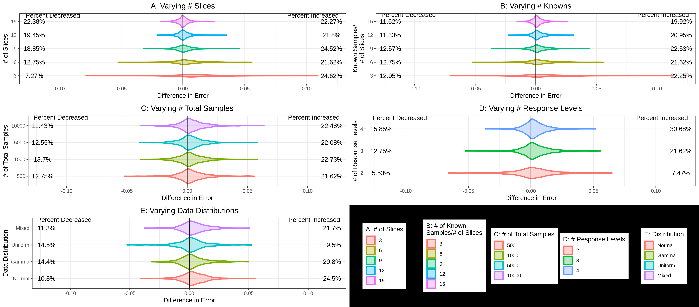

This is my approach on reproducing a paper by Fleming et al. with Nextflow:

To run this pipeline you will need:
- Nextflow: https://www.nextflow.io/docs/latest/install.html
    - I recommend self install method check success with bash command 'nextflow info'
- Anaconda3 (Conda): https://www.anaconda.com/docs/getting-started/anaconda/install
    - Ensure you have succesfully installed and attaached conda to path via bash: 'conda --version'
- In your IDE's terminal, run command:
    - 'nextflow run main.nf'
- Figures will be generated and saved under the 'figures' directory.

Here are the reproduced figures 7-10:

Figure 7 - Convergence Plots

Figure 8 - MAE Plots

Figure 9 - GAD Difference Plots

Figure 10 - PAC Analysis

Fleming, J. F., House, J. S., Chappel, J. R., Motsinger-Reif, A. A., & Reif, D. M. (2024). Guided optimization of ToxPi model weights using a Semi-Automated approach. Computational toxicology (Amsterdam, Netherlands), 29, 100294. https://doi.org/10.1016/j.comtox.2023.100294